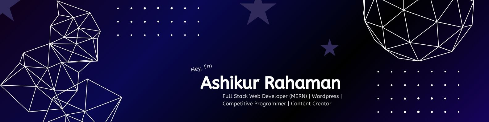
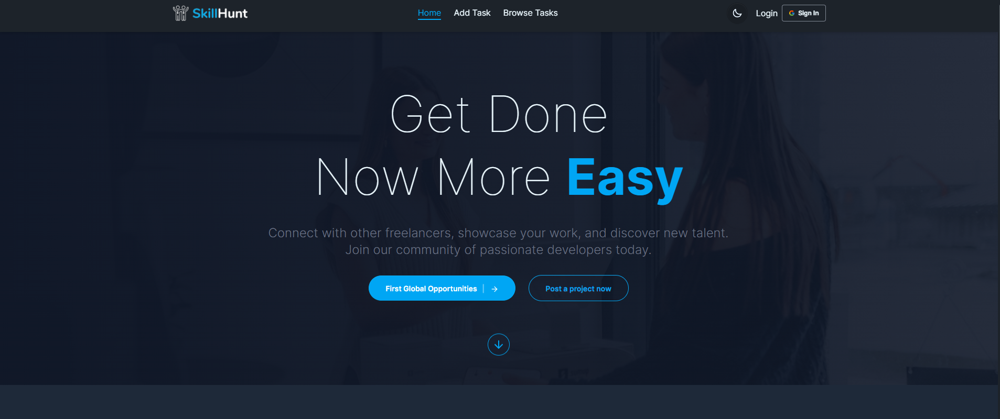
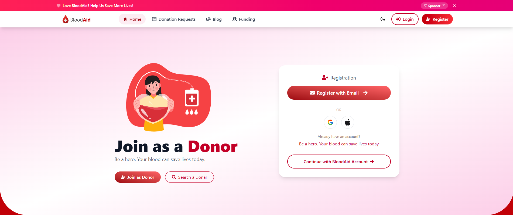

<!-- Banner -->

<h1 align="center">Hi, I'm Ashik 👋</h1>

🚀 MERN Stack Developer | 🤖 AI Enthusiast | 🌍 Based in Bangladesh

---

### 🌱 About Me
I'm a passionate Full Stack Developer from Bangladesh, skilled in React, Node.js, Firebase, and WordPress. I love building fast, responsive, and secure web apps that solve real-world problems. Currently, I'm focused on growing as a remote developer while exploring modern tech stacks and personal growth through calisthenics.

---

### 🎯 Current Focus

- 💻 Actively building **MERN Stack** projects and exploring the capabilities of **Next.js**
- 🤖 Integrating **AI tools & APIs** into full-stack projects to solve **real-world problems**
- 🔍 Learning advanced concepts like **Authentication**, **Role-Based Dashboards**, and **Scalable UI Design**
- 📦 Improving skills in **Backend Architecture**, **REST APIs**, and **Full-Stack Deployment**
- 🌱 2025 Goal: **Master TypeScript** and start contributing to **open-source projects**
- 🚀 Passionate about building **real-world applications** that are practical, scalable, and impactful

---

## 🛠️ Skills & Technologies

### 🎨 Frontend

### 🛠️ Backend

### 🧩 CMS / No-Code

### 🔧 Tools & Workflow

---

## 🚀 Projects

### 🔹 [Skill Hunt Global](https://skill-hunt-global.web.app/)
A freelance marketplace platform connecting clients and freelancers in a seamless environment.

- 🛠️ Core Features:
  - Post & bid on freelance tasks  
  - Role-based dashboard (Admin, Client, Freelancer)  
  - Task management, bidding system, and secure login
- ⚙️ Tech Stack: React, TailwindCSS, Firebase Auth, MongoDB, Express.js, Node.js

**🖼️ Screenshot**  

---

### 🔹 [Blood Aid Now](https://blood-aid-now.web.app/)
A real-time blood donation platform to connect donors, volunteers, and those in need across Bangladesh.

- 🛠️ Core Features:
  - Role-based dashboards (Admin, Donor, Volunteer)  
  - Request blood, manage campaigns, approve donors  
  - Status control, secure login, and user management
- ⚙️ Tech Stack: React, TailwindCSS, Firebase, Node.js, Express, MongoDB

**🖼️ Screenshot**  

---

### 📊 GitHub Stats

 

  

  
  

  
  
  
   
     
  

---

### 📫 Let’s Connect
- 📧 Email: [mdaashikur@gmail.com](mailto:mdaashikur@gmail.com)
- 💼 LinkedIn: [linkedin.com/in/mdaashikur](https://linkedin.com/in/mdaashikur)

---

> *“Build things. Break things. Learn things.”*
